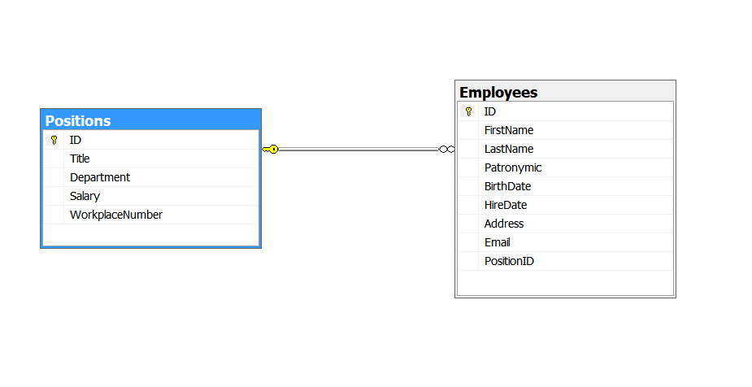

# Справочники: Сотрудники и Должности

### Автор: Король Иван  
### Группа: 11  
### Курс: 3  
### Год: 2024  

---

## Описание справочников

### Справочник: **Сотрудники**
Хранит информацию о сотрудниках.

| Поле                  | Тип данных        |
|-----------------------|-------------------|
| `ID`                 | `Guid` / `INT`     |
| `Имя`                | `NVARCHAR`         |
| `Фамилия`            | `NVARCHAR`         |
| `Отчество`           | `NVARCHAR`         |
| `Дата рождения`      | `DATE`             |
| `Дата приема на должность` | `DATE`       |
| `Адрес`              | `NVARCHAR`         |
| `Почта`              | `NVARCHAR`         |
| `ID должности`       | `Guid` / `INT`     |

---

### Справочник: **Должности**
Хранит информацию о должностях.

| Поле                  | Тип данных        | 
|-----------------------|-------------------|
| `ID`                 | `Guid` / `INT`     |
| `Наименование`       | `NVARCHAR`         |
| `Отдел`              | `NVARCHAR`         |
| `Заработная плата`   | `DECIMAL(18, 2)`   |
| `Номер рабочего места` | `INT`            |

---

### Диаграмма спроектированной БД

